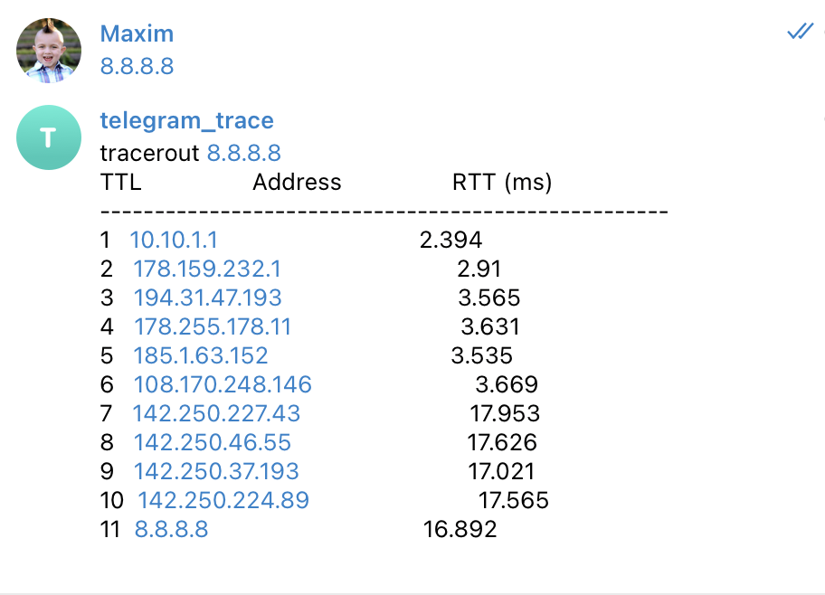

# Telegram Bot

Simple telegram bot that could answer traceroute request on provided IP address or domain name.

__Requirements__:
* Deploy on a [Heroku](https://dashboard.heroku.com/apps/telegram-trace)
* Hosting on a [Bitbucket](https://bitbucket.org/maximka07/telegram-trace/src/main/)
* Use Telegram API: I chose a [Python framework](https://github.com/python-telegram-bot/python-telegram-bot)

## Installation

```
# optional virtual env
virtualenv local_env 
source local_env/bin/activate

pip install -r requirements.txt
```

## Usage

You will require unique API key that Telegram generates for each bot - ask [BotFather](https://t.me/botfather) for this.
Run each time you want to start a bot-server.
```
export T_TOKEN=YOUR_OWN_API_KEY
python3 __main__.py
```
Run the bot until you press Ctrl-C or the process receives SIGINT, SIGTERM or SIGABRT.

**NOTE**: May be required root rights for the traceroute command -- use __sudo -E__ while starting server 


Here is an example of conversation:



## Author

**Maksym Halchenko** - [maxs-im](https://github.com/maxs-im)

[Github Repository](https://github.com/maxs-im/telegram-trace)
